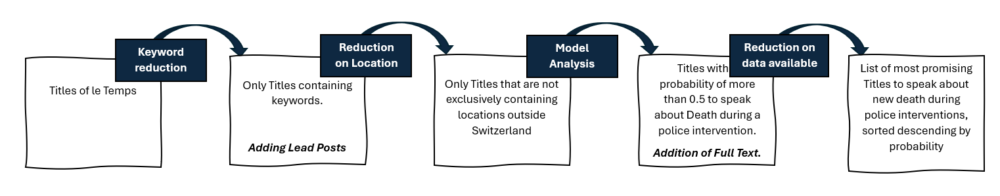
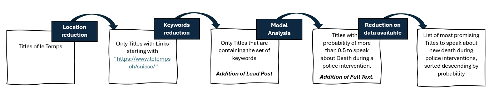
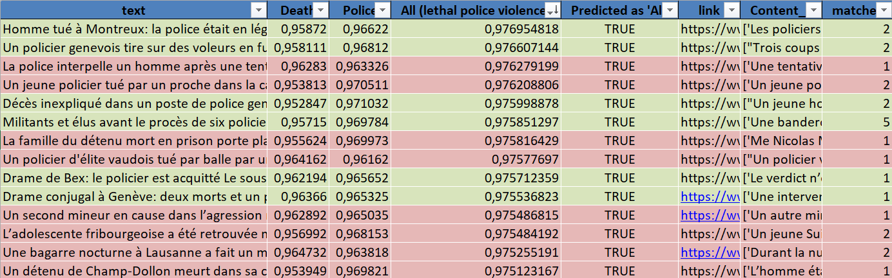
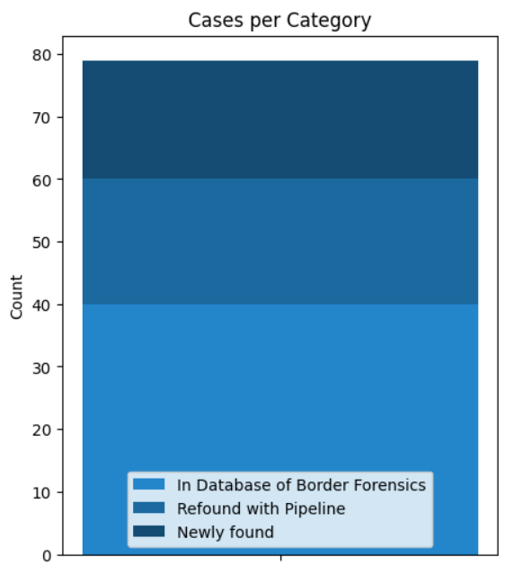
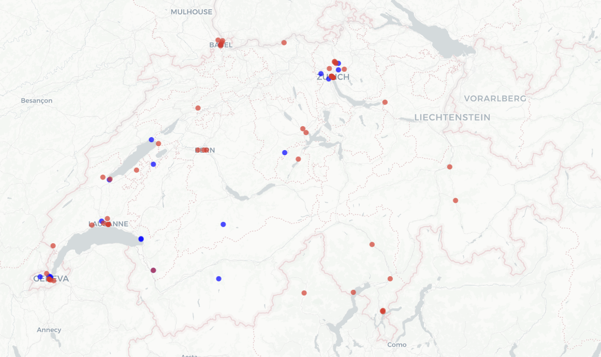

# Database-deaths-in-context-of-police-interventions
TOWARDS A DATABASE OF CIVIL DEATHS AS A RESULT OF POLICE INTERVENTIONS  
*Semester Project Minor Data Sciences EPFL, 2025*

Student: Stefanie Helfenstein  
Supervisor EPFL: Jérome Baudry, LHST (Laboratory for the History of Sciences and Technology)  
Supervisor Border Forensics: Stanislas Michel  

## Goal
*The objective is to create a database documenting every case in which a civilian has died as a result of an encounter with a police or gendarmerie officer—regardless of the circumstances leading to the intervention, the social or demographic characteristics of the deceased, or the nature and severity of any suspected offence.*

## About
To date, there is no centralized database recording deaths occurring during police interventions in Switzerland. In contrast, several other countries maintain such statistics, whether through official channels or independent initiatives. For example, in France, data is officially collected by the IGPN (Inspection Générale de la Police Nationale), as well as independently by the media outlet Basta. In England, the organization Inquest gathers this information, while in the United States, projects such as Mapping Police Violence and the Washington Post provide similar documentation.

In Switzerland, various organizations — such as Augenauf and Amnesty International — have attempted to collect such information locally and on a partial basis. However, there is currently no comprehensive database documenting deaths resulting from police interventions. This lack of systematic data collection hinders efforts to shed light on critical issues, particularly in a context where the UN Working Group of Experts on People of African Descent has raised concerns about structural anti-Black racism and impunity in Switzerland.

As part of a semester project in collaboration with Prof. Baudry from the Laboratory for the History of Science and Technology and the NGO Border Forensics, our goal is to develop an informative database of deaths occurring in the context of police interventions in Switzerland. Drawing on the Archives from the newspaper *'Le Temps'*, the project aims to establish a methodology for an automated and as exhaustive as possible identification of cases of civil deaths resulting from police interventions. 

## Research Summary
### Methodology
To carry out the project, two main phases were adressed. The first involved discussions and interviews with experts in the field, aimed at deepening my understanding of the topic and integrating the insights gained into the project’s approach. In the second phase, the code was developed based on the acquired knowledge.

In the first phase, interviews were conducted with a journalist from Basta, a expert from Amnesty International, and lawyers involved in cases where civilians died during police interventions. Their expertise provided valuable insights into the topic, which were incorporated into the project—particularly in elements such as the 'Keyword Filter' step of the code.  
  
In the second phase, a pipeline of the code was developped. Given that the database contains a vast number of articles and NGOs often lack access to high-performance computing resources, a two-step pipeline was implemented to reduce the volume of data processed. Another reason for adopting this pipeline was to prevent system overload caused by processing an extensive amount of data. By reducing the size of the dataset at each step before adding new textual data about each article, we were able to minimize the number of requests made at once, which allowed the system to function properly.

### Results
The result of the code is a list of most promising articles that are talking about deaths as a result of police interventions. The articles are matched on name, location of death, origin, age, date. In order to attain this goal, we implemented two distinct pipelines: the first tested a more generalizable approach that should be better adaptable to other newspapers, while the second is adapted specifically to ’Le Temps’, incorporating the newspaper’s internal article categorization structure. The different reduction steps are precised more detailed in the report. 

**Pipeline 1**  
The following outlines the general structure of the first pipeline. In this setup, the Lead Postdata is integrated after the Keyword Reduction Step, but before the dataset is filtered based on location, as it is precised more in detail in the report.

**Pipeline 2**
The second pipeline applied the same keyword filtering step. However, it uses the structure of the website of the Archives of ’Le Temps’, where articles related to events in Switzerland are categorized under URLs beginning with "https://www.letemps.ch/suisse/". Thanks to this straightforward filtering method, the location-based reduction was performed before the keyword filtering step. The Lead Post data was then added later in the process, just prior to the model analysis. This resulted therefore in the following pipeline:

**Outputs**  
When comparing the two Pipelines and their outcomes, the second one conveinced more. It was the Pipeline used finally to produce the outcome, the list with the most promising titles  

  

During the work on the datasets, a total of 19 new death cases could have been identified.2
deaths needed to be added as they occured in the period during which the work was conducted.
Furthermore, the work allowed to reveal the opportunities but also the limits of the natural lan-
guage processing for such research work  

The cases of death during police interventions in the dataset could be classified at the end in
three main categories: The ones, that were newly found during this semester projects. The ones,
that were re-encountered with help of the Pipeline, where the title as well appeared in the highest
percentage of Titles. And then the ones, that couldn’t be found with help of the pipeline.  

  

An analysis of the newly found or re-encountered cases reveals a clear trend toward the French-
speaking part of Switzerland: the majority of these cases originate from that region.Given that
the newspaper is French-language, its coverage is naturally focused on events in the French-
speaking part of Switzerland. Of the 30 cases newly identified or re-encountered with the help of
our model’s output, only 13 came from non–French-speaking regions. By contrast, out of a total
16 of 41 undetected cases, only 8 were from Romandie (the French-speaking region). This suggests
that a significant number of cases from the German- or Italian-speaking regions of Switzerland
likely remain undiscovered, indicating that the dataset probably remains incomplete. This shows,
that developing models for the other national languages remains an important next step, but was
beyond the scope of what I could accomplish during my semester project.Furthermore, it should
be noted that the "True" cases in the training set consisted of those that had already been
identified and were already present in the dataset. Since the training set was in French, only
cases that could be retrieved from French-language newspapers were included. As a result, the
probability that these cases reappear in the final list is higher than for cases that did not occur
in Switzerland or were not covered by French-language media.  

A more in depth analysis of the results, the limits and the difficulties encountered during the project can be found in the report (report/Final_Report). 

## Installation and Usage 
Due to the size of the model, it hasn't been uploaded here. It must be recreated by the user himself (code provided). Furthermore, the dataset provided by Border Forensics is confidential. Therefore, those datasets arn't provided here. The scripts are in the folder notebook. Depending which Pipeline you are running, they must been run in different order (See the pipelines above). 

The packages are installed at the beginning of each Jupyter notebook. For the script 'Apply_model.ipynb' and 'Matching.ipynb', the 'requirements_environ3.txt' must be used. For all other files, 'requirements_environ2.txt' can be used (two different environments, that wern't compatible). 

